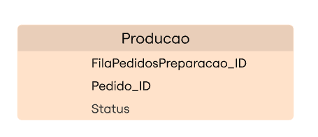

# Tech Challenge - Fase 4

---

## Integrantes do grupo:

- Jose Augusto dos Santos- RM 361650
- Nathalia Matielo Rodrigues- RM 363100
- Rogerio Inacio Silva Junior- RM 364104
- Vanessa Moreira Wendling - RM 362741

---

## 📦 Funcionalidades Entregues na Fase 4

- Implementação de API Gateway
- Implementação de autenticação via Cognito
- Implementação de infra com Kubernets com terraform
- Criação de repositorio de infra com terraform para os bancos de dados SQL/NOSQL
- Branches Main/Master protegidas
- Deploy automatizado via CI/CD
- Criação de microserviços: Pedido, Produtos, Pagamento e Produção
- Comunicação entre serviços via chamada direta
- Implementação de um caminho de teste com BDD
- Cobertura de testes superior a 80%

---
## 💡 Solução Proposta

Foi desenvolvido um sistema de autoatendimento para fast food, que:

- Permite que o cliente faça pedidos diretamente via interface, podendo se identificar por CPF, cadastrar-se ou permanecer anônimo.


- O cliente pode montar o combo em etapas opcionais: Lanche, Acompanhamento e Bebida, com exibição clara de nome, descrição e preço.


- Possui integração com Mercado Pago via QRCode para pagamento.


- Exibe para o cliente um monitor de acompanhamento do pedido, com status atualizados em tempo real: Recebido, Em preparação, Pronto e Finalizado.


- Notifica o cliente quando o pedido estiver pronto para retirada.


- Permite ao estabelecimento gerenciar clientes, produtos e acompanhar os pedidos em andamento.


---

### Requisitos contemplados

- Escalabilidade e alta disponibilidade com Kubernetes.
- Segurança e gerenciamento de configuração via Secrets e ConfigMaps.
- Visibilidade e controle total via painel administrativo.

---


##  Modelagem de dados



---

## 🎥 Vídeo Demonstrativo

Assista ao vídeo com demonstração do funcionamento da aplicação e da arquitetura: https://youtu.be/hqAwc3LQJfs


---

## ⚙️ Tecnologias Utilizadas

- Java 17
- Spring Boot
- Kubernetes 
- Amazon Cognito
- API Gateway
- MariaDB (Banco de dados)
- Amazon RDS
- Terraform
- Github Actions

---

## 🚀 Como Executar Localmente

1. Instale JDK 17 e Maven.
2. Clone o repositório:
    ```bash
    git clone https://github.com/SOAT-FIAP-GROUP/SOAT_Producao.git
    cd SOAT_Producao
    ```
3. Crie o banco de dados RDS via terraform

4. Execute a aplicação via Maven:
    ```bash
    mvn spring-boot:run
    ```
5. Acesse a documentação Swagger:
    ```
    http://localhost:8082/swagger-ui/index.html
    ```
## 🚀 Como Executar via Kubernetes
1. Instalar Kubernetes com Minikube, ou
2. Instalar Docker Desktop e ativar Kubernetes
   - Se estiver usando **Minikube** habilite o metrics-server (necessário para HPA funcionar):
    ```bash
    minikube addons enable metrics-server
    ```
   - Aplique os manifetos YAML:
    ```bash
    kubectl apply -f k8s/
    ```
   - **Se estiver usando Minikube:**
    ```bash
    minikube service producao-service
    ```

   Esse comando deve abrir automaticamente uma aba no navegador com a URL.  
   Acesse `.../swagger-ui/index.html` no final da URL para ver a documentação dos endpoints.

   - **Se estiver usando Docker Desktop:**

   Acesse diretamente no navegador:

   - http://localhost:30000/
   - http://localhost:30000/swagger-ui/index.html

   Neles você poderá visualizar a documentação interativa (OpenAPI/Swagger) dos endpoints disponíveis.

   - Endpoints para Health Checks:
      - Liveness Probe:
     ```bash
     /actuator/health/liveness
     ```
      - Readiness Probe:
     ```bash
     /actuator/health/readiness
     ```

---


## 📚 Endpoints e Exemplos


#### 🔍📚 Collection API (Postman)

Para ter acesso aos Endpoints e exemplos faça o download da collection e importe na sua IDE de preferência:
[Collection API](https://drive.google.com/uc?export=download&id=1xp52ZV3tcdlxPq5wG7C6tpEA4O6jXKvB)

---


### Produção

#### 🚚 Finalizar pedido

**POST** `/entregar`

**Body:**
```json
{
  "pedidoId": 1,
  "dataHoraSolicitacao": "2025-08-02T12:54:53Z"
}
```

**Resposta:**
```json
{
  "data": {
    "codigo": 1,
    "status": "FINALIZADO",
    "dataHoraEntrega": "2025-06-03T04:33:39.72109629"
  },
  "errors": [],
  "success": true
}
```

---


